<div align="center">

### Multi-Tenant E-Commerce Analytics Platform with AI-Powered Insights

---

**Technical Report**

*Advanced Application Development — 2026*

---

<br><br>

**Project Repository:** [github.com/yusufsamiluzum/e-commerce-2026](https://github.com/yusufsamiluzum/e-commerce-2026)

<br>

| | |
|---|---|
| **Name/Surname** | Yusuf Şamil ÜZÜM |
| **Student Number** | 20230808615 |
| **Submission Date** | April 26, 2026 |

<br><br>

---

### Technology Stack

`Spring Boot 4.0` · `Angular 20 (SSR)` · `MySQL 8` · `LangGraph` · `Docker Compose`

---

</div>

<div style="page-break-after: always;"></div>

## Table of Contents

1. [Architecture Decisions and Justifications](#1-architecture-decisions-and-justifications)
2. [Database Design with ER Diagrams](#2-database-design-with-er-diagrams)
3. [ETL Process Documentation with Field Mappings](#3-etl-process-documentation-with-field-mappings)
4. [API Documentation Overview](#4-api-documentation-overview)
5. [AI Chatbot Architecture Explanation](#5-ai-chatbot-architecture-explanation)
6. [Challenges Faced and Solutions Implemented](#6-challenges-faced-and-solutions-implemented)

<div style="page-break-after: always;"></div>

## 1. Architecture Decisions and Justifications

### 1.1 System Overview

DataPulse is a **multi-tenant B2C e-commerce platform** that combines transactional commerce capabilities with embedded business intelligence and a natural-language analytics interface. The system is built around three strictly isolated user roles — `INDIVIDUAL` (customer), `CORPORATE` (store owner), and `ADMIN` (platform operator) — each with its own UI module, endpoint set, and data-access scope.

The platform is composed of four cooperating services orchestrated by Docker Compose:

| Service | Technology | Port | Responsibility |
|---|---|---|---|
| **Frontend** | Angular 20 SSR + Tailwind v4 | 4200 → 4000 | UI for all three roles, server-side rendering for SEO |
| **Backend API** | Spring Boot 4.0 (Java 21) | 8080 | REST API, RBAC enforcement, business logic |
| **Database** | MySQL 8 | 3306 | OLTP store, single source of truth |
| **AI Chatbot** | Python + LangGraph + FastAPI | 8000 | Multi-agent Text2SQL pipeline (optional profile) |

### 1.2 High-Level Architecture

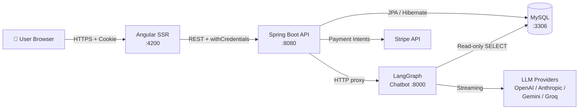

### 1.3 Key Architectural Decisions

#### Decision 1 — Monolithic Backend over Microservices

**Choice:** A single Spring Boot application owns the entire transactional domain (catalog, cart, orders, payments, reviews, refunds, analytics).

**Justification:**
- The domain is **tightly coupled around shared aggregates** (an order references products, a refund references an order, analytics aggregate orders). Splitting these into services would require distributed transactions or sagas — overhead disproportionate to the team size and project scope.
- A single deployable unit drastically simplifies local development, testing, and the grading workflow.
- The **chatbot is the only externalized service**, because (a) it is implemented in Python for the LangGraph ecosystem, and (b) its workload is fundamentally different (long-lived, LLM-bound) from short request/response API calls.

#### Decision 2 — Multi-Tenancy via Logical Isolation (`store_id` / `user_id`)

**Choice:** All tenants share one database and one schema. Tenant isolation is enforced at the **query level** by filtering on `store_id` (corporate) or `user_id` (individual) derived from the authenticated JWT principal.

**Justification:**
- Database-per-tenant would multiply schema migrations, backup costs, and analytical complexity.
- Frontend-supplied IDs are **never trusted**; every corporate repository method takes `storeId` from the JWT-resolved principal, and every individual query is scoped to the authenticated user. This is enforced both at `SecurityConfig` URL level and at method level via `@PreAuthorize`.
- This pattern keeps the analytics layer trivial: aggregating across tenants for the admin dashboard is a single `GROUP BY` query, not a fan-out across N databases.

#### Decision 3 — Cookie-Based JWT, Not Bearer Header

**Choice:** JWT is issued at login, set as an `HttpOnly` `SameSite=Lax` cookie with 24h expiry, and read by `JwtAuthenticationFilter` from the cookie — never from the `Authorization` header.

**Justification:**
- `HttpOnly` cookies are **not accessible to JavaScript**, eliminating XSS-based token theft.
- Angular requests use `withCredentials: true`; the browser attaches the cookie automatically, removing the need for a token-management layer in the frontend.
- CORS is hardcoded to `http://localhost:4200` to prevent cross-origin cookie leakage.

**Trade-off accepted:** Cookie-based auth is more vulnerable to CSRF than bearer tokens. Mitigated by `SameSite=Lax` and the fact that all state-changing endpoints are non-GET. A CSRF-token layer would be added before production.

#### Decision 4 — Angular Signals for Auth State, RxJS for HTTP

**Choice:** Synchronous, frequently-read auth state (`currentUserRole`, `currentUserName`, `hasStore`) lives in Angular **Signals**. All HTTP and async event streams use **RxJS Observables**.

**Justification:**
- Signals provide **fine-grained, dependency-tracked reactivity** with no subscription/teardown ceremony — ideal for state that drives navbar rendering, route guards, and conditional UI.
- RxJS remains the right tool for HTTP because of operators like `switchMap`, `debounceTime`, `catchError` and `retry`, which are essential in the catalog filter and search flows.
- Non-sensitive identity (role, name, email) is mirrored to `localStorage` so a hard page refresh does not flicker the UI back to a guest state. The JWT itself stays in the `HttpOnly` cookie.

#### Decision 5 — Lazy-Loaded Feature Modules with Role Guards

**Choice:** All feature areas (`catalog`, `cart`, `checkout`, `corporate`, `admin`, `individual`, `ai-assistant`) are lazy-loaded standalone Angular modules, each protected by a chain of guards: `authGuard → roleGuard → notCorporateGuard` (where applicable).

**Justification:**
- Role separation is a **first-class architectural concern**, not a runtime check buried in components. A `CORPORATE` user attempting to load `/cart` is rejected at the route level before any component is instantiated.
- Lazy loading keeps the initial bundle small — the SSR-rendered landing page does not ship the admin dashboard's chart libraries.
- Each module's bundle is independent, which means adding an admin feature cannot regress catalog performance.

#### Decision 6 — `ddl-auto=create` + DatabaseSeeder for Development

**Choice:** In development, Hibernate drops and recreates the schema on every backend restart, and `DatabaseSeeder.java` (a `CommandLineRunner`) repopulates a realistic dataset.

**Justification:**
- The schema is still actively evolving; a destructive recreate cycle prevents migration drift between developers.
- A deterministic seed gives every team member the **same demo data** — same admin, same corporate stores, same products, orders, reviews, and refunds — making bug reproduction trivial.
- For production, this setting will be switched to `validate` and migrations will be managed by Flyway. The decision is explicitly documented as a development-only choice in `CLAUDE.md`.

#### Decision 7 — LangGraph for the Chatbot, Not a Single Prompt

**Choice:** The Text2SQL chatbot is a 5-node LangGraph state machine — `Guardrail → SQL Agent → [Error Agent ×3 retries] → Analysis Agent → [Viz Agent]` — rather than a single "translate this to SQL and execute" prompt.

**Justification:**
- A single prompt cannot enforce **role-scoped query rewriting**, retry on syntax errors, *and* return a chart specification. Decomposing into nodes makes each concern testable in isolation.
- The Guardrail node rejects any query attempting to read outside the caller's `storeId` / `user_id` scope **before** the SQL ever reaches the database.
- The Error Agent's bounded retry loop (max 3) prevents runaway LLM costs while still recovering from typical syntax mistakes.
- Provider-agnostic design (OpenAI, Anthropic, Gemini, Groq, Ollama) is selected per-request via `llm_provider` in the request body, so the system survives any single provider outage.

### 1.4 Cross-Cutting Concerns

| Concern | Approach |
|---|---|
| **Authentication** | JWT in `HttpOnly` cookie, 24h expiry, validated by `JwtAuthenticationFilter` |
| **Authorization** | Dual-layer — `SecurityConfig` URL rules + `@PreAuthorize` method annotations |
| **Tenant isolation** | `store_id` / `user_id` filter on every repository method, derived from JWT principal |
| **File uploads** | Stored under `./uploads/`, served at `/uploads/**`, capped at 10 MB / 15 MB request |
| **Payments** | Stripe SDK, key from `STRIPE_API_KEY` env (fallback `sk_test_placeholder`) |
| **CORS** | Restricted to `http://localhost:4200` in `SecurityConfig` |
| **Observability** | Spring Boot Actuator endpoints + structured logging |
| **Dev workflow** | Single `docker-compose up --build` brings the whole stack up |

### 1.5 Why This Architecture Fits the Requirements

The brief requires a **multi-tenant B2C e-commerce platform with embedded analytics and an AI chatbot**. The chosen architecture directly addresses each axis:

- **Multi-tenancy** → logical isolation at query level, RBAC enforced at two layers.
- **Commerce** → monolithic Spring Boot owning the full transactional aggregate, with Stripe for payments.
- **Analytics** → server-side aggregation on the same OLTP store (no separate warehouse needed at this scale), surfaced through role-scoped dashboards.
- **AI chatbot** → externalized LangGraph service, security-scoped per request, multi-provider for resilience.
- **Developer experience** → one Docker command, deterministic seed data, hot reload on both frontend and backend.

The result is a system that is **small enough for a student team to operate end-to-end**, yet exhibits the architectural patterns (RBAC, tenant isolation, agent-based AI, SSR) expected in a production-grade platform.

<div style="page-break-after: always;"></div>

## 2. Database Design with ER Diagrams

### 2.1 Schema Overview

The DataPulse schema is a **single MySQL 8 database** (`datapulse_db`) generated from JPA `@Entity` classes via Hibernate. It contains **16 tables** organized into five logical domains:

| Domain | Tables |
|---|---|
| **Identity & Access** | `users`, `customer_profiles`, `corporate_profiles`, `user_preferences` |
| **Tenant & Catalog** | `stores`, `categories`, `products`, `product_images` |
| **Commerce** | `orders`, `order_items`, `payment_methods`, `shipments`, `refunds` |
| **Engagement** | `reviews` |
| **Platform Operations** | `audit_logs`, `system_config` |

The schema is regenerated on every backend restart in development (`spring.jpa.hibernate.ddl-auto=create`) and reseeded by `DatabaseSeeder.java`.

### 2.2 Master ER Diagram

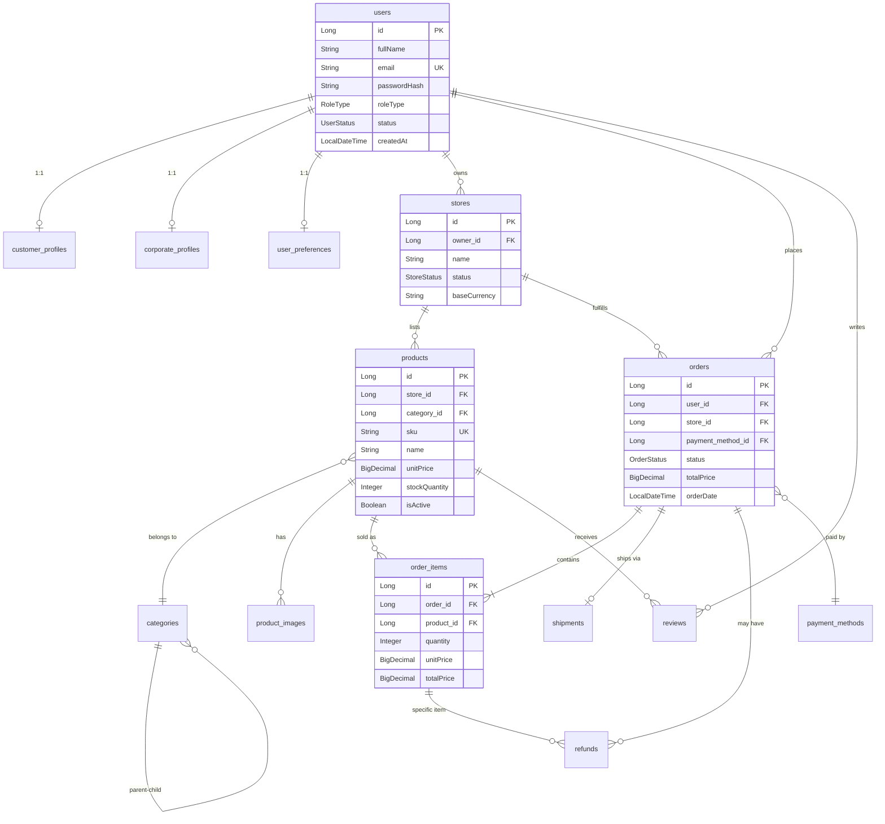

### 2.3 Domain-Level Diagrams

#### 2.3.1 Identity & Access Domain

A polymorphic user model: a single `users` table holds **all roles** (`INDIVIDUAL`, `CORPORATE`, `ADMIN`), discriminated by `role_type`. Role-specific attributes live in 1:1 satellite profiles, avoiding sparse columns on the master table.

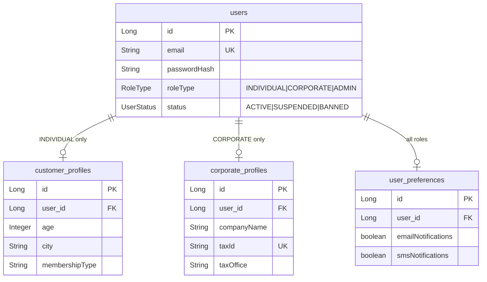

**Key constraint:** `email` is globally unique. `taxId` is unique within `corporate_profiles`. The chatbot's RBAC layer reads `roleType` and `id` from the JWT to scope every SQL query.

#### 2.3.2 Tenant & Catalog Domain

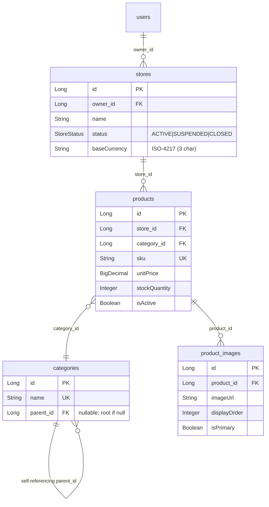

**Multi-tenancy anchor:** `products.store_id` is the column on which all corporate-side queries filter. Without this filter, a store owner could read or modify another store's catalog. The constraint is enforced in service-layer code (`@PreAuthorize` + JPA `where` clauses derived from JWT).

`categories` is **self-referential** to support nested taxonomies (e.g., `Electronics → Laptops → Gaming Laptops`). The seeder builds a 2-level hierarchy.

#### 2.3.3 Commerce Domain

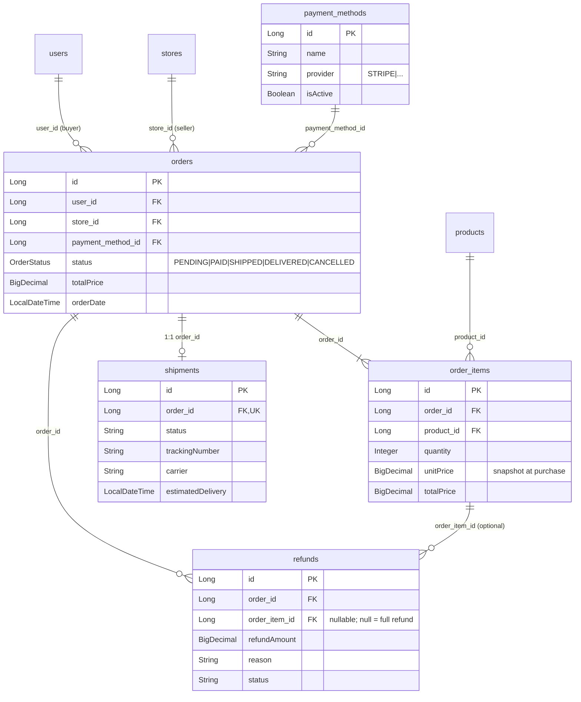

**Critical design choices:**

- `order_items.unitPrice` is a **snapshot** of the product price at purchase time. This decouples historical orders from later catalog price changes — a regulatory and accounting requirement.
- `shipments` is **1:1** with `orders` (`@OneToOne`) — the prototype assumes one shipment per order; splitting into multiple parcels would require relaxing this to `1:N`.
- `refunds.order_item_id` is **nullable**. A `null` value means a full-order refund; a populated value means a per-line refund. This single table covers both cases without a discriminator column.

#### 2.3.4 Engagement Domain

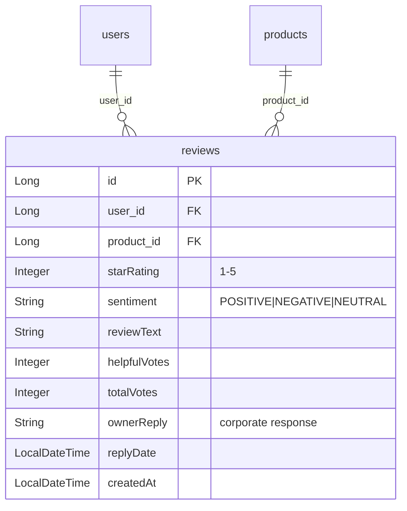

**Notes:**
- `sentiment` is precomputed (potentially by the chatbot pipeline) so analytics queries do not have to invoke an LLM at read time.
- `ownerReply` and `replyDate` keep store responses inline — no separate `review_replies` table because a review has at most one owner reply.
- Application-level rule: a review can only be created by a user who has at least one **`DELIVERED`** order containing the product. This is enforced in `ReviewService`, not as a DB constraint.

#### 2.3.5 Platform Operations Domain

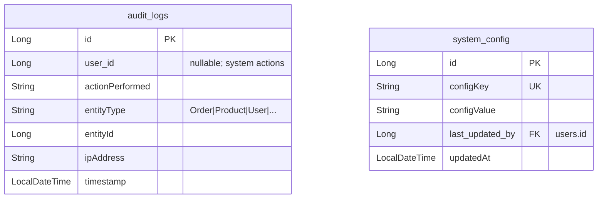

**Audit log** is a write-only, append-only stream consumed by the admin dashboard. It is **not** a foreign-key target — `entityId` is a logical reference, not a constrained one, because the referenced entity may be deleted (and we want the log to survive).

**System config** is the platform's runtime tuning surface (rate limits, feature flags, default currency). Mutations go through the admin UI and are themselves audit-logged.

### 2.4 Cardinality Summary

| Relationship | Type | FK Location | Notes |
|---|---|---|---|
| `users` → `customer_profiles` | 1:0..1 | `customer_profiles.user_id` | Only for INDIVIDUAL |
| `users` → `corporate_profiles` | 1:0..1 | `corporate_profiles.user_id` | Only for CORPORATE |
| `users` → `user_preferences` | 1:0..1 | `user_preferences.user_id` | All roles |
| `users` → `stores` | 1:N | `stores.owner_id` | One owner can have multiple stores |
| `stores` → `products` | 1:N | `products.store_id` | Tenant boundary |
| `categories` → `categories` | 1:N | `categories.parent_id` | Self-referencing tree |
| `categories` → `products` | 1:N | `products.category_id` | Logical FK (non-managed) |
| `products` → `product_images` | 1:N | `product_images.product_id` | Cascade delete |
| `users` → `orders` | 1:N | `orders.user_id` | Buyer |
| `stores` → `orders` | 1:N | `orders.store_id` | Seller |
| `orders` → `order_items` | 1:N | `order_items.order_id` | Cascade delete |
| `products` → `order_items` | 1:N | `order_items.product_id` | Restrict delete |
| `orders` → `shipments` | 1:0..1 | `shipments.order_id` | Unique FK |
| `orders` → `refunds` | 1:N | `refunds.order_id` | Multiple partial refunds allowed |
| `order_items` → `refunds` | 1:N | `refunds.order_item_id` | Nullable for full-order refunds |
| `users` → `reviews` | 1:N | `reviews.user_id` | One per (user, product) by app rule |
| `products` → `reviews` | 1:N | `reviews.product_id` | |

### 2.5 Indexing Strategy

The schema is generated by Hibernate, which creates indexes for **primary keys** and **unique constraints** automatically. Beyond those, the following columns are heavily used as filter/join keys and are expected to be indexed in production:

| Table | Column(s) | Reason |
|---|---|---|
| `products` | `store_id`, `category_id`, `is_active` | Catalog browse + tenant filter |
| `orders` | `user_id`, `store_id`, `status`, `order_date` | Customer history, fulfillment dashboard, time-series analytics |
| `order_items` | `order_id`, `product_id` | Cascade reads, top-products analytics |
| `reviews` | `product_id`, `user_id`, `star_rating` | Product detail page, moderation queues |
| `audit_logs` | `entity_type`, `entity_id`, `timestamp` | Admin audit search |

In development, Hibernate's `create` strategy emits only the bare-minimum indexes; production deployment will introduce a Flyway migration that adds the composite indexes above.

### 2.6 Why a Single OLTP Database (No Warehouse)

The brief asks for embedded analytics. We deliberately chose **not** to introduce a separate analytics warehouse (Snowflake, BigQuery, dbt, etc.) at this stage:

- **Data volume is bounded** by a class project's seed scale — well under the threshold where OLTP/OLAP separation becomes necessary.
- **Aggregations are simple** — `GROUP BY store_id, DATE(order_date)` over a few hundred thousand rows runs in tens of milliseconds on MySQL with the indexes above.
- The chatbot's **read-only role** runs `SELECT` against the same OLTP database; introducing a warehouse would force a second ETL into the chatbot pipeline (a real cost for a marginal gain at this scale).

Once the platform crosses the point where OLTP queries start contending with analytical reads, an outbound CDC stream into a columnar store becomes the natural next step.

<div style="page-break-after: always;"></div>

## 3. ETL Process Documentation with Field Mappings

### 3.1 ETL Philosophy in DataPulse

DataPulse does not run a classical batch ETL into a separate warehouse. Instead, the platform applies the **Extract → Transform → Load** discipline at four discrete boundaries inside its runtime:

| # | Pipeline | Trigger | Purpose |
|---|---|---|---|
| **P1** | **Seed Pipeline** | Backend boot (`CommandLineRunner`) | Reset → repopulate the schema with deterministic demo data |
| **P2** | **Inbound API Pipeline** | HTTP POST/PUT from the Angular frontend | DTO validation → entity persistence (write path) |
| **P3** | **Analytics Aggregation Pipeline** | HTTP GET on `/corporate/analytics/**` and `/admin/**` | Raw OLTP rows → role-scoped analytics DTOs (read path) |
| **P4** | **Text2SQL Pipeline** | HTTP POST `/chat` | Natural-language question → SQL → result set → narrative + chart spec |

Each pipeline follows the same conceptual contract — a strict separation between **source format**, **transformation rules**, and **target format** — even though the implementations differ.

### 3.2 P1 — Seed Pipeline (`DatabaseSeeder`)

#### 3.2.1 Overview

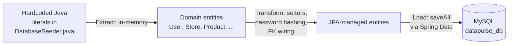

#### 3.2.2 Process Steps

1. **Truncate** all 16 tables in FK-safe reverse-dependency order (`auditLogs → refunds → reviews → shipments → orderItems → paymentMethods → orders → products → corporateProfiles → customerProfiles → stores → categories → users → systemConfig`).
2. **Build** entity graphs in dependency order (parents before children).
3. **Hash** the shared dev password (`123Pa$$word!`) once with `BCryptPasswordEncoder`.
4. **Wire** foreign-key relations through JPA setters (`store.setOwner(seller1)`, `order.setStore(s1)`, etc.).
5. **Persist** each tier with `repository.saveAll(...)` — Hibernate auto-assigns IDs and emits the FK columns.

#### 3.2.3 Volume After Successful Run

| Tier | Entity | Rows |
|---|---|---|
| 1 | `system_config` | 5 |
| 2 | `users` (1 admin, 3 corporate, 10 individual) | 14 |
| 3 | `categories` | 5 |
| 4 | `stores` | 3 |
| 5 | `corporate_profiles` / `customer_profiles` | 3 / 10 |
| 6 | `products` | 12 |
| 7 | `payment_methods` | 3 |
| 8 | `orders` (PENDING, PROCESSING, SHIPPED, DELIVERED, CANCELLED) | 18 |
| 9 | `order_items` | 21 |
| 10 | `shipments` | 6 |
| 11 | `reviews` (sentiment-tagged, 4 with owner replies) | 17 |
| 12 | `refunds` (PROCESSED + PENDING) | 3 |
| 13 | `audit_logs` | 5 |

The seeder is **idempotent by design**: it always wipes first, so two consecutive boots yield byte-identical state.

### 3.3 P2 — Inbound API Pipeline

This is the **write path** for end-user actions (place order, write review, register, etc.). The pipeline is deliberately thin: validate, transform DTO → entity, persist.

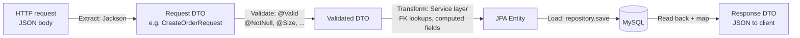

#### 3.3.1 Worked Example — Place Order

**Source:** `POST /api/orders` with `CreateOrderRequest`:
```json
{
  "items": [{"productId": 1, "quantity": 2}],
  "paymentMethodId": 1
}
```

**Field-level transformation (`OrderService.createOrder`):**

| Source field (DTO) | Transformation | Target field (entity) |
|---|---|---|
| *(JWT cookie)* | Resolve principal → load `User` | `Order.user` |
| `items[].productId` | `productRepository.findById` → assert active + in stock | `OrderItem.product` |
| `items[].quantity` | Validate `≥ 1`, decrement `Product.stockQuantity` | `OrderItem.quantity` |
| *(derived)* | Read `product.unitPrice` at this moment (snapshot) | `OrderItem.unitPrice` |
| *(derived)* | `quantity × unitPrice` | `OrderItem.totalPrice` |
| *(derived)* | `Σ orderItems.totalPrice` | `Order.totalPrice` |
| `paymentMethodId` | Validate exists + active | `Order.paymentMethodId` |
| *(derived)* | First product's `store_id` (single-store cart invariant) | `Order.store` |
| *(derived)* | `LocalDateTime.now()` | `Order.orderDate` |
| *(derived)* | `OrderStatus.PENDING` | `Order.status` |

**Audit side-effect:** an `AuditLog` row is appended (`actionPerformed="CREATE_ORDER"`, `entityType="ORDER"`, `entityId=order.id`, `userId=principal.id`, `ipAddress=request.remoteAddr`).

#### 3.3.2 Validation Rules Applied During Transform

| Rule | Where | Action on Violation |
|---|---|---|
| Email uniqueness on register | `AuthService` | 409 Conflict |
| `quantity ≥ 1` and `≤ stockQuantity` | `OrderService` | 400 Bad Request |
| `starRating ∈ [1,5]` | `ReviewService` | 400 Bad Request |
| Reviewer must have a `DELIVERED` order containing the product | `ReviewService` | 403 Forbidden |
| Refund amount `≤ orderItem.totalPrice` (or order total for full refund) | `RefundService` | 400 Bad Request |
| Corporate user must own the store referenced by the resource | All corporate services | 403 Forbidden |

### 3.4 P3 — Analytics Aggregation Pipeline

This is the **read path** that powers corporate and admin dashboards. Raw OLTP rows are aggregated on-demand into role-scoped DTOs. There is no materialized table — every dashboard hit is a fresh query.

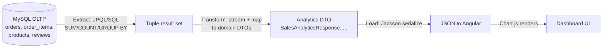

#### 3.4.1 Field Mappings — Sales Analytics (`SalesAnalyticsService.getAnalytics`)

Source query (paraphrased):
```sql
SELECT DATE(o.order_date) AS day, SUM(o.total_price) AS revenue, COUNT(*) AS orders
FROM orders o
WHERE o.store_id = :storeId
  AND o.status IN ('DELIVERED','SHIPPED')
  AND o.order_date BETWEEN :start AND :end
GROUP BY DATE(o.order_date)
ORDER BY day;
```

| Source (DB column / aggregate) | Transformation | Target field (`SalesAnalyticsResponse`) |
|---|---|---|
| `DATE(orders.order_date)` | Cast to `LocalDate`, format `yyyy-MM-dd` | `dailyRevenue[].date` |
| `SUM(orders.total_price)` | Round to 2 decimals | `dailyRevenue[].revenue` |
| `COUNT(orders.id)` | — | `dailyRevenue[].orderCount` |
| `Σ revenue across days` | Computed in service | `totalRevenue` |
| `Σ orderCount` | Computed in service | `totalOrders` |
| `totalRevenue ÷ totalOrders` | Guard against div-by-zero | `averageOrderValue` |
| Top-product subquery (`order_items` joined to `products`, sorted by `SUM(quantity)` desc, limit 5) | Mapped row-by-row | `topProducts[]` |

#### 3.4.2 Field Mappings — Customer Segmentation (`CustomerSegmentationService`)

| Source | Transformation | Target |
|---|---|---|
| `customer_profiles.city` + `COUNT` of orders | `GROUP BY city` | `byCity[]` |
| `customer_profiles.membershipType` + `SUM(total_price)` | `GROUP BY membership_type` | `byMembership[]` |
| `customer_profiles.age` bucketed (`<25`, `25–34`, `35–44`, `45+`) | CASE WHEN in SQL | `byAgeGroup[]` |
| `users.id` ranked by `SUM(orders.total_price)` desc, limit 10 | Subquery + service-side mapping | `topCustomers[]` |

#### 3.4.3 Tenant-Scope Enforcement

Every analytics query receives the authenticated user's `storeId` (corporate) or operates platform-wide (admin). The `WHERE store_id = :storeId` clause is **never optional** for corporate endpoints — its absence would cross the tenant boundary. Code review and `@PreAuthorize("hasRole('CORPORATE')")` are the two backstops.

### 3.5 P4 — Text2SQL Pipeline (Chatbot)

The chatbot is itself an ETL pipeline: a question is **extracted**, **transformed** through five LangGraph nodes, and the **result is loaded** into a structured response (text + optional chart spec). Full architecture is detailed in §5; here we focus on the data-flow contract.

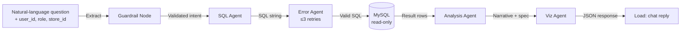

#### 3.5.1 Field Mappings — Chat Request → Chat Response

| Stage | Source field | Transformation | Target field |
|---|---|---|---|
| Request | `body.message` (string) | Pass to Guardrail | `state.user_question` |
| Request | `body.user_id`, `body.user_role`, `body.store_id` | Loaded from JWT principal in Spring before forwarding | `state.security_context` |
| Guardrail → SQL Agent | `state.user_question` | Prompt-template + schema injection | `state.candidate_sql` |
| SQL Agent → DB | `state.candidate_sql` | Append `WHERE store_id = :store_id` (corporate) or user filter (individual) | Final SQL string |
| DB → Analysis | Result rows (list of dicts) | Stream summary → LLM | `state.analysis_text` |
| Analysis → Viz | `state.analysis_text` + columns | Pick chart type heuristically (line for time series, bar for categorical) | `state.chart_spec` (Vega-Lite-like JSON) |
| Viz → Response | All of the above | Serialize | `{ "answer": ..., "sql": ..., "chart": ... }` |

#### 3.5.2 Schema Mapping for the SQL Agent

The SQL agent is given a **trimmed schema** description — only tables and columns the caller is allowed to read, with sensitive columns stripped. For example, for a `CORPORATE` user:

| Allowed table | Visible columns | Hidden columns |
|---|---|---|
| `orders` | `id, store_id, total_price, status, order_date, user_id` | — |
| `order_items` | `id, order_id, product_id, quantity, unit_price, total_price` | — |
| `products` | `id, store_id, name, sku, unit_price, stock_quantity, category_id` | — |
| `users` | *(joined-only via FK)* `id`, `gender`, `created_at` | `password_hash`, `email`, `full_name` |
| `customer_profiles` | `age, city, membership_type` | — |
| ❌ `audit_logs`, `system_config`, other stores' data | — | (entirely hidden) |

This schema-trim happens in the chatbot's `security/` module **before** the prompt is sent to the LLM, so the model cannot even formulate a forbidden query.

### 3.6 Data Lineage Summary

| Surface | Owner of TRUTH | Derived From | Refresh Cadence |
|---|---|---|---|
| `users`, `products`, `orders`, `order_items`, `reviews`, `refunds`, `shipments` | OLTP MySQL (write path P2) | User actions | Real-time |
| Sales / Customer / Inventory dashboards | `SalesAnalyticsService`, etc. (P3) | OLTP tables | On every dashboard hit |
| Chatbot answers | `chatbot-service` (P4) | OLTP tables (read-only) | On every user message |
| Demo data | `DatabaseSeeder` (P1) | Hardcoded literals | Every backend boot (dev only) |

### 3.7 Why No Separate Warehouse / Batch ETL?

A traditional Airflow-style nightly ETL into a star-schema warehouse was **explicitly out of scope**:

- **Latency requirement:** corporate dashboards must reflect new orders within seconds (not "by tomorrow"), which a nightly batch cannot satisfy.
- **Volume:** seed-scale (≈18 orders) plus expected hand-tested data does not justify the operational cost of dbt/Airflow/Snowflake.
- **Read-after-write consistency:** the chatbot must answer questions about orders that exist *right now*. A snapshot warehouse would lag.

When data volume grows beyond what MySQL can aggregate in <500 ms, the natural evolution is **CDC into a columnar store** (Debezium → Kafka → ClickHouse / Snowflake) without changing the application layer — pipelines P3 and P4 would then read from the warehouse instead of the OLTP store.

<div style="page-break-after: always;"></div>

## 4. API Documentation Overview

### 4.1 Interactive Documentation (Swagger / OpenAPI)

The backend ships with **`springdoc-openapi-starter-webmvc-ui` v3.0.2**, declared in `backend/pom.xml`. This dependency auto-generates a live OpenAPI 3 specification by reflecting over Spring controllers, request/response DTOs, and Bean Validation annotations — no hand-maintained spec file is required.

**Access points (when the backend is running on port 8080):**

| Resource | URL |
|---|---|
| Swagger UI (interactive) | `http://localhost:8080/swagger-ui/index.html` |
| OpenAPI 3 JSON spec | `http://localhost:8080/v3/api-docs` |
| OpenAPI 3 YAML spec | `http://localhost:8080/v3/api-docs.yaml` |

The Swagger UI page allows reviewers to **try every endpoint live**: it issues real HTTP requests against the running backend, including JWT-cookie authentication after a successful login call. The JSON/YAML specs can be imported into Postman, Insomnia, or any OpenAPI-aware client to generate client SDKs.

> **Reproducibility note:** the spec is regenerated on every backend boot, so it always reflects the current code. There is no "stale doc" risk — pulling the latest commit and starting Docker Compose is enough to view the up-to-date API.

### 4.2 API Design Conventions

| Concern | Convention |
|---|---|
| **Base path** | All endpoints under `/api/**`; non-`/api/**` paths are static or SSR-rendered |
| **Resource grouping** | One controller per domain (`AuthController`, `OrderController`, `CorporateController`, ...) |
| **Naming** | Plural nouns (`/products`, `/orders`); subresources nested (`/orders/{id}/cancel`) |
| **HTTP verbs** | `GET` read · `POST` create · `PUT` full update · `PATCH` partial/state change · `DELETE` remove |
| **Auth transport** | `HttpOnly` JWT cookie (24h); `Authorization` header **not used** |
| **Authorization** | `@PreAuthorize` on every state-changing endpoint; URL-level rules in `SecurityConfig` |
| **CORS** | Restricted to `http://localhost:4200`, `withCredentials=true` |
| **Status codes** | `200 OK`, `201 Created`, `204 No Content`, `400` validation, `401` unauth, `403` forbidden, `404` missing, `409` conflict |
| **Errors** | Uniform `{ "timestamp", "status", "error", "message", "path" }` JSON shape |
| **Validation** | Jakarta Bean Validation (`@NotBlank`, `@Size`, `@Email`, `@Min`) on DTOs; auto-translated to `400` |
| **Pagination** | `?page=0&size=20&sort=createdAt,desc` on list endpoints (Spring Data conventions) |

### 4.3 Endpoint Inventory by Role

The full endpoint surface is partitioned by role at the controller level. The Swagger UI presents them grouped — admins should expect to use only `/api/admin/**`, corporate users `/api/corporate/**`, customers `/api/orders` + catalog endpoints.

#### 4.3.1 Public — `AuthController` (`/api/auth`)

| Method | Path | Purpose |
|---|---|---|
| POST | `/register/individual` | Sign up as customer |
| POST | `/register/corporate` | Sign up as store owner |
| POST | `/admin/register` | Admin-only: create another admin |
| POST | `/login/individual` | Customer login → JWT cookie |
| POST | `/login/corporate` | Corporate login → JWT cookie |
| POST | `/login/admin` | Admin login → JWT cookie |

#### 4.3.2 Catalog (Public Read) — `ProductController`, `CategoryController`

| Method | Path | Purpose |
|---|---|---|
| GET | `/api/products` | Paginated catalog (filter by category, store, price, search) |
| GET | `/api/products/{id}` | Product detail + images + reviews |
| GET | `/api/categories` | Category tree |

#### 4.3.3 Customer (`INDIVIDUAL` only) — `OrderController`, `ReviewController`, `MyReviewController`, `RefundController`, `PaymentController`, `UserController`, `UserPreferenceController`

| Method | Path | Purpose |
|---|---|---|
| POST | `/api/orders` | Place an order from cart contents |
| GET | `/api/orders` | List own orders |
| GET | `/api/orders/{id}` | Order detail (own only) |
| PATCH | `/api/orders/{id}/cancel` | Cancel a `PENDING` / `PROCESSING` order |
| POST | `/api/payments/create-intent` | Stripe Payment Intent for checkout |
| POST | `/api/reviews` | Write a review (only on `DELIVERED` orders) |
| GET | `/api/my-reviews` | List own reviews |
| POST | `/api/refunds` | Open a refund request |
| GET / PUT | `/api/users/me` | Profile read / update |
| GET / PUT | `/api/user-preferences` | Notification toggles |

#### 4.3.4 Corporate (`CORPORATE` + `ADMIN`) — `CorporateController` (`/api/corporate`)

23 endpoints, all guarded by `@PreAuthorize("hasAnyRole('CORPORATE','ADMIN')")` and tenant-scoped by the JWT-resolved `storeId`:

| Group | Endpoints |
|---|---|
| **Store management** | `POST/GET/PUT /store` |
| **Dashboard** | `GET /dashboard` (KPI summary) |
| **Catalog (own store)** | `GET /products`, `GET /products/{id}`, `POST /products`, `PUT /products/{id}`, `DELETE /products/{id}`, `PATCH /products/{id}/reactivate`, `GET /categories` |
| **Order fulfillment** | `GET /orders`, `PATCH /orders/{id}/status` |
| **Inventory** | `GET /inventory`, `PATCH /inventory/{productId}/stock` |
| **Analytics** | `GET /analytics`, `GET /customers` |
| **Reviews** | `GET /reviews`, `PUT /reviews/{reviewId}/reply`, `DELETE /reviews/{reviewId}/reply` |
| **Refunds** | `GET /refunds`, `PATCH /refunds/{id}/status` |

#### 4.3.5 Admin (`ADMIN` only) — `AdminController` (`/api/admin`)

24 endpoints, all guarded by `@PreAuthorize("hasRole('ADMIN')")`:

| Group | Endpoints |
|---|---|
| **Dashboard** | `GET /dashboard`, `GET /dashboard/revenue-trend` |
| **User management** | `GET /users`, `PATCH /users/{id}/status` |
| **Store oversight** | `GET /stores`, `GET /stores/{id}`, `PATCH /stores/{id}/status`, `GET /stores/comparison` |
| **Order oversight** | `GET /orders`, `PATCH /orders/{id}/status` |
| **Refund oversight** | `GET /refunds`, `PATCH /refunds/{id}/status` |
| **Catalog taxonomy** | `GET/POST /categories`, `PUT/DELETE /categories/{id}` |
| **System config** | `GET /config`, `PUT /config/{id}` |
| **Audit & moderation** | `GET /audit-logs`, `GET /reviews`, `DELETE /reviews/{id}` |
| **CSV export** | `GET /export/users`, `GET /export/orders` (`text/csv`) |

#### 4.3.6 AI — `ChatController` (`/api/chat`)

| Method | Path | Purpose |
|---|---|---|
| POST | `/api/chat/ask` | Forward a natural-language question to the LangGraph chatbot, scoped by the caller's role/IDs |

### 4.4 Sample Request / Response

**Login (corporate):**
```http
POST /api/auth/login/corporate
Content-Type: application/json

{ "email": "seller1@test.com", "password": "123Pa$$word!" }
```
Response sets `Set-Cookie: jwt=...; HttpOnly; SameSite=Lax; Max-Age=86400`.

**List own products (corporate):**
```http
GET /api/corporate/products?page=0&size=10&sort=stockQuantity,asc
Cookie: jwt=...
```
```json
{
  "content": [
    { "id": 7, "sku": "TH-MN01", "name": "LG UltraWide 34WN80C",
      "unitPrice": 449.99, "stockQuantity": 3, "isActive": true }
  ],
  "page": { "number": 0, "size": 10, "totalElements": 8 }
}
```

**Place order (individual):**
```http
POST /api/orders
Cookie: jwt=...
Content-Type: application/json

{ "items": [{ "productId": 1, "quantity": 1 }], "paymentMethodId": 1 }
```
Returns `201 Created` with the persisted `OrderResponse` including `id`, `status: "PENDING"`, snapshot prices, and `orderDate`.

### 4.5 Error Contract

All controller errors flow through a single `@RestControllerAdvice` (Spring's `ResponseEntityExceptionHandler` + custom handlers) and produce a uniform body:

```json
{
  "timestamp": "2026-04-26T13:42:11.083Z",
  "status": 400,
  "error": "Bad Request",
  "message": "quantity must be at least 1",
  "path": "/api/orders"
}
```

Validation failures aggregate per-field messages under a `fieldErrors` key when multiple constraints fail in one request.

### 4.6 Security Notes for API Consumers

- **Cookies are required.** Every authenticated call must travel with the `jwt` cookie; CORS is locked to `http://localhost:4200`. Other origins will be rejected at the preflight stage.
- **No silent role escalation.** Calling `/api/admin/**` with an `INDIVIDUAL` JWT returns `403`, not `404` — by design, so the client surfaces a clear authorization error.
- **Multi-tenant isolation is opaque.** A corporate user querying `/api/corporate/orders` cannot pass a `storeId` parameter to read another store's data; the controller ignores any client-supplied store ID and uses the JWT-resolved one.
- **Stripe keys are not exposed to the browser.** Only `publishableKey` is returned by `POST /api/payments/create-intent` for the front-end Stripe Elements widget; the secret key remains server-side.

<div style="page-break-after: always;"></div>

## 5. AI Chatbot Architecture Explanation

### 5.1 Goal and Scope

The chatbot — branded **DataPulse Assistant** — exists so that non-technical users can ask analytical questions in plain language ("How many iPhone Pro Max units did Tech Haven sell last week?") and receive an answer, the SQL that produced it, and an optional chart. It is a **read-only Text2SQL** system: it never writes to the database, never accesses sensitive columns (e.g. `password_hash`), and is bounded by the caller's RBAC scope.

### 5.2 Service Layout

The chatbot is a standalone **Python FastAPI** service running on port 8000, started under the `chatbot` Docker Compose profile:

```
chatbot-service/
├── main.py              # FastAPI entry, /chat endpoint, LLM provider factory
├── agents/
│   ├── state.py         # AgentState TypedDict
│   ├── graph.py         # LangGraph StateGraph wiring
│   ├── guardrail.py     # Node 1 — scope/greeting filter
│   ├── sql_agent.py     # Node 2 — NL → SQL
│   ├── error_agent.py   # Node 3 — SQL repair (≤3 retries)
│   ├── analysis_agent.py# Node 4 — result → narrative
│   └── visualization_agent.py # Node 5 — Plotly code
├── security/rbac.py     # Per-role SQL rewriting (WHERE clause injection)
├── db/
│   ├── connection.py    # Read-only MySQL connection pool
│   └── schema.py        # Trimmed schema fed to the SQL agent
└── sql/create_readonly_user.sql # Provisioning script for the read-only DB role
```

The Spring `ChatController` (`POST /api/chat/ask`) is the **only** trusted caller. It enriches the request with the JWT-resolved `user_role`, `user_id`, and `store_id` before forwarding to `http://chatbot:8000/chat`.

### 5.3 LangGraph State Machine

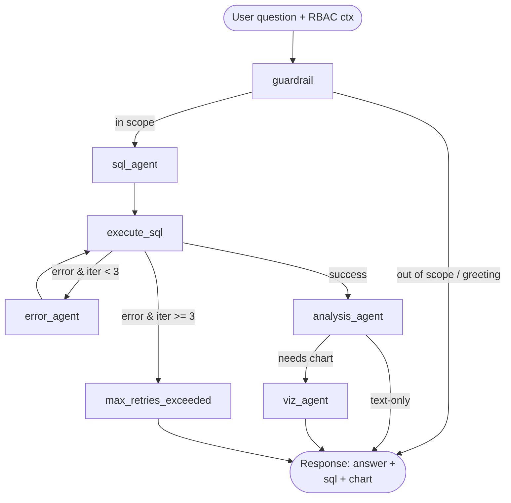

The graph is built in `agents/graph.py`:

```python
graph = StateGraph(AgentState)
graph.add_node("guardrail", guardrail_node)
graph.add_node("sql_agent", sql_node)
graph.add_node("execute_sql", execute_sql_node)
graph.add_node("error_agent", error_node)
graph.add_node("analysis_agent", analysis_node)
graph.add_node("viz_agent", viz_node)
graph.add_node("max_retries_exceeded", max_retries_node)
graph.add_conditional_edges("guardrail", after_guardrail, {...})
graph.add_edge("sql_agent", "execute_sql")
graph.add_conditional_edges("execute_sql", after_execute, {...})
graph.add_edge("error_agent", "execute_sql")
graph.add_conditional_edges("analysis_agent", after_analysis, {...})
graph.add_edge("viz_agent", END)
graph.add_edge("max_retries_exceeded", END)
```

### 5.4 Agent State (`AgentState` TypedDict)

```python
class AgentState(TypedDict):
    question: str                       # user input
    sql_query: Optional[str]            # latest candidate SQL
    query_result: Optional[Any]         # pandas DataFrame or dict
    error: Optional[str]                # last DB error, if any
    final_answer: Optional[str]         # Analysis Agent output
    visualization_code: Optional[str]   # Plotly Python (executed in sandbox)
    is_in_scope: bool                   # set by Guardrail
    iteration_count: int                # ≤ 3, prevents retry loops
    user_role: str                      # ADMIN | CORPORATE | INDIVIDUAL
    user_id: str                        # used for individual scoping
```

State is the **only** channel between nodes. No node mutates a global; LangGraph hands each node a fresh copy and merges deltas.

### 5.5 Per-Node Responsibilities

| Node | Input | Output | Notes |
|---|---|---|---|
| **guardrail** | `question` | `is_in_scope`, possibly `final_answer` | Catches greetings ("hi") and out-of-scope queries ("write me a poem") with cheap classification before any SQL is generated |
| **sql_agent** | `question` + trimmed schema | `sql_query` | LLM is told to emit raw SQL only — no markdown, no commentary |
| **execute_sql** | `sql_query` | `query_result` or `error` | Runs against the **read-only DB user** through a pooled connection |
| **error_agent** | `error`, `sql_query` | new `sql_query`, `iteration_count++` | Bounded by `iteration_count < 3`; otherwise routes to `max_retries_exceeded` |
| **analysis_agent** | `query_result`, `question` | `final_answer` (text) + decision: chart? | Produces the natural-language explanation |
| **viz_agent** | `query_result`, `final_answer` | `visualization_code` (Plotly Python) | Only invoked when the analysis flag says a chart adds value |
| **max_retries_exceeded** | `error` | `final_answer` (graceful failure) | "Sorry, I couldn't answer that — please rephrase." |

### 5.6 Multi-Provider LLM Support

The provider is **chosen per-request** by the calling Spring `ChatController`, based on `system_config` (`chatbot_llm_provider`, `chatbot_llm_model`). `main.py` exposes a factory:

```python
def get_llm(provider: str, model: str):
    if provider == "openai":     return ChatOpenAI(model=model, ...)
    if provider == "anthropic":  return ChatAnthropic(model=model, ...)
    if provider == "gemini":     return ChatGoogleGenerativeAI(model=model, ...)
    if provider == "groq":       return ChatGroq(model=model, ...)
    if provider == "ollama":     return ChatOllama(model=model, ...)
    raise ValueError(f"Desteklenmeyen LLM provider: {provider}")
```

API keys are read from environment (`OPENAI_API_KEY`, `ANTHROPIC_API_KEY`, `GEMINI_API_KEY`, `GROQ_API_KEY`). Defaults seeded by `DatabaseSeeder`: provider = `openai`, model = `gpt-4o-mini`.

This design lets an admin switch the active model from the admin UI without redeploying the chatbot — a useful resilience and cost-tuning lever (e.g., temporarily route to `ollama` for local-only testing, or to `gemini` if OpenAI is rate-limiting).

### 5.7 Security Architecture

The chatbot is the **most security-sensitive component** in the system because it executes LLM-generated SQL. Three independent layers protect the database:

#### Layer 1 — Read-Only Database User

The chatbot connects to MySQL as a dedicated user that has **only `SELECT`** privileges and only on tables the chatbot is allowed to read. Provisioned by `sql/create_readonly_user.sql`. Even if every other layer fails, the database itself rejects writes.

#### Layer 2 — Schema Trim per Role

`db/schema.py` returns a different schema description depending on `user_role`. The SQL agent never sees columns it shouldn't generate — `password_hash`, `email`, the entirety of `audit_logs`, etc. are absent from the prompt. This prevents the model from even attempting forbidden queries.

#### Layer 3 — RBAC SQL Rewriting (`security/rbac.py`)

Before execution, every SQL string passes through `enforce_rbac(sql, user_role, user_id, store_id)`:

```python
def enforce_rbac(sql, user_role, user_id, store_id):
    if user_role == "INDIVIDUAL":  return _enforce_individual(sql, user_id)
    if user_role == "CORPORATE":   return _enforce_corporate(sql, store_id)
    if user_role == "ADMIN":       return sql, None   # full read access
```

For `INDIVIDUAL`, any reference to user-scoped tables (`orders`, `reviews`, `refunds`, ...) gets a `WHERE user_id = :user_id` clause injected. For `CORPORATE`, references to store-scoped tables (`orders`, `products`, `order_items` via join, ...) get `WHERE store_id = :store_id` injected. The injection works on parsed table names, not string matching, so it is robust against aliasing.

If the SQL touches a table the role is not permitted to read, the function returns an error and the query is **never executed**.

#### Defense-in-Depth Summary

| Threat | Layer that stops it |
|---|---|
| LLM hallucinates a `DROP TABLE` | DB user has no DDL/DML — Layer 1 |
| LLM tries to `SELECT password_hash` | Column not in trimmed schema — Layer 2; if it leaked, RBAC layer would still allow it (column-level not enforced here, see §5.10 limitations) |
| Corporate user asks "what did store 99 sell?" | RBAC injects `WHERE store_id = :owned_store` — Layer 3 |
| Individual user asks "show all orders" | RBAC injects `WHERE user_id = :me` — Layer 3 |
| Prompt injection ("ignore the rules") | Even if SQL agent is convinced, Layers 1+3 still apply |

### 5.8 Request / Response Contract

**Request** (`POST /chat`):
```json
{
  "question": "Bu hafta en çok satan 5 ürünüm hangisi?",
  "user_role": "CORPORATE",
  "user_id": "2",
  "store_id": "1",
  "llm_provider": "openai",
  "llm_model": "gpt-4o-mini"
}
```

**Response** (`ChatResponse`):
```json
{
  "answer": "Bu hafta Tech Haven'da en çok satan 5 ürün ...",
  "sql_query": "SELECT p.name, SUM(oi.quantity) AS sold FROM ... WHERE o.store_id = 1 ... LIMIT 5",
  "visualization_code": "import plotly.express as px ...",
  "in_scope": true,
  "error": null
}
```

The Spring backend exposes this through `/api/chat/ask`, attaching JWT-resolved RBAC context server-side so the browser can never spoof `store_id`.

### 5.9 Visualization Generation

The viz agent emits **Plotly Python source**, not pre-rendered images. The frontend (Angular) receives the code and either:
- displays it for transparency ("How was this chart built?"), or
- forwards it to a sandboxed renderer.

We deliberately do **not** `exec()` LLM-generated Python in the chatbot process. Code execution sandboxing is a future enhancement; today the rendered chart is produced client-side by interpreting the generated spec or by the frontend reissuing the underlying SQL via the analytics API.

### 5.10 Known Limitations

| Limitation | Mitigation Today | Path Forward |
|---|---|---|
| Column-level RBAC inside permitted tables (e.g., `users.email`) is not yet enforced at the SQL rewriter level | Schema trim hides columns from the prompt | Add column-allowlist check post-parse |
| LLM cost is unbounded per question | `iteration_count` ≤ 3, but no per-user rate limit | Add token-budget tracking and per-user quota |
| Plotly code is returned as text only, not executed | Frontend renders or ignores | Sandboxed Python runner (e.g., Pyodide or restricted Jupyter kernel) |
| Schema changes require regenerating the chatbot's `db/schema.py` | Manual sync today | Auto-generate from JPA `@Entity` introspection |

### 5.11 Why a Multi-Agent Graph (Not a Single Prompt)

A single mega-prompt — "given this question and schema, write SQL, run it, summarize, draw a chart" — fails on every dimension that matters:

| Concern | Single prompt | Multi-agent graph |
|---|---|---|
| **Retry on syntax errors** | Impossible without a tool loop | Built-in: `error_agent` runs up to 3× |
| **Per-step observability** | One opaque trace | Each node logs its input/output |
| **Scope rejection cheaply** | Full prompt fires for "hi" | Guardrail rejects in milliseconds |
| **Independent provider tuning** | All-or-nothing | A cheap model can guard, a strong one can SQL |
| **Security insertion point** | Hard to inject post-LLM | RBAC layer sits between SQL agent and execution |
| **Testability** | Test the whole black box | Each node has a focused unit test |

The five-node graph is the smallest decomposition that buys all of the above without becoming over-engineered. Adding more nodes (e.g., a planner, a clarifier) is a future option; today, the graph hits the right complexity sweet spot for the project's scale.

<div style="page-break-after: always;"></div>

## 6. Challenges Faced and Solutions Implemented

This section documents the most consequential problems encountered during DataPulse's development and the engineering decisions taken to resolve them. Each challenge is presented with **context, attempted approaches, the chosen solution**, and the **trade-off accepted**.

### 6.1 Multi-Tenant Data Isolation Without a Per-Tenant Database

**Challenge.** Three roles (`ADMIN`, `CORPORATE`, `INDIVIDUAL`) share one schema, but a corporate user must **never** see another store's orders, products, refunds, or analytics. A single missing `WHERE store_id = ?` clause is a security breach.

**Approaches considered:**
1. *Database-per-tenant* — operationally heavy, breaks platform-wide admin analytics.
2. *Schema-per-tenant* — same drawbacks, plus migration complexity.
3. *Row-level security in MySQL* — MySQL 8 has no native RLS; emulating it via views was brittle.
4. ✅ *Application-layer filtering anchored to the JWT principal.*

**Chosen solution.** Two enforcement layers, both required:

- **`@PreAuthorize` at the method level** in every controller, paired with URL-level rules in `SecurityConfig`. A `CORPORATE` JWT cannot reach `/api/admin/**` and vice versa.
- **`storeId` / `userId` derived from the JWT principal** (never trusted from the request body). Every corporate repository method takes the resolved ID as a filter; every individual query is scoped to `userId`. This is mirrored in the chatbot's `security/rbac.py`, which rewrites SQL before execution.

**Trade-off accepted.** A bug in service code can still leak data — there is no DB-level safety net. Mitigated by code review and by routing all chatbot SQL through a separate read-only user with explicit `WHERE` injection. A future migration to PostgreSQL with `ROW LEVEL SECURITY` would close this gap.

### 6.2 LLM-Generated SQL Touching Forbidden Data

**Challenge.** The Text2SQL chatbot lets users ask analytical questions, but a clever prompt could trick the LLM into emitting `SELECT * FROM users` or a query targeting another tenant's `store_id`.

**Approaches considered:**
1. *Trust the LLM and hope* — unacceptable.
2. *Hand-write a parser that allowlists query shapes* — too restrictive for natural-language analytics.
3. ✅ *Defense in depth: read-only DB user + trimmed schema + post-LLM SQL rewrite.*

**Chosen solution.** Three independent layers (detailed in §5.7):

- **Read-only DB user** — even a malicious `DROP TABLE` is rejected by the database.
- **Schema trim** — sensitive columns (`password_hash`, `email`) are not visible in the prompt, so the LLM cannot reference them.
- **`enforce_rbac()`** — parses the generated SQL, identifies referenced tables, and injects `WHERE store_id = :store_id` (corporate) or `WHERE user_id = :user_id` (individual) before execution. Tables outside the allowlist abort the query.

**Trade-off accepted.** Column-level RBAC inside permitted tables is not yet enforced at the SQL-rewriter layer (e.g., a corporate user could in principle read `users.gender`). Today this is mitigated by schema trim; the long-term fix is a column allowlist post-parse.

### 6.3 Cookie-Based JWT vs. Bearer Header

**Challenge.** Storing JWTs in `localStorage` is a well-known XSS sink — any cross-site script becomes a session hijack. Bearer headers also require the frontend to manage refresh logic, expiry, and re-auth races.

**Chosen solution.** JWT in an `HttpOnly`, `SameSite=Lax` cookie with 24h expiry. The Angular HTTP client uses `withCredentials: true`; the browser attaches the cookie automatically. The `JwtAuthenticationFilter` reads from the cookie, never from `Authorization`. CORS is locked to `http://localhost:4200`.

**Trade-off accepted.** Cookie auth is more vulnerable to **CSRF**. We mitigate with `SameSite=Lax` and the fact that all state-changing endpoints are non-GET (so cross-site forms cannot trigger them silently). Production deployment will add a CSRF-token layer.

### 6.4 Schema Recreated on Every Boot (`ddl-auto=create`)

**Challenge.** During active development, the JPA model changes daily. Manual migrations on every restart were a tax on every team member, and divergent local schemas caused "works on my machine" bugs.

**Chosen solution.** `spring.jpa.hibernate.ddl-auto=create` drops and rebuilds the schema on every boot, and `DatabaseSeeder.java` (a `CommandLineRunner`) repopulates a deterministic dataset (14 users, 12 products, 18 orders, 17 reviews, 3 refunds — see §3.2.3). Bug reports are reproducible because everyone starts from the same state.

**Trade-off accepted.** Test data created by hand at runtime is **lost on every restart**. The `CLAUDE.md` file warns about this explicitly. Production switches to `ddl-auto=validate` with Flyway-managed migrations.

### 6.5 Auth State on Page Refresh (UI Flicker)

**Challenge.** The JWT lives in an `HttpOnly` cookie inaccessible to JavaScript. On a hard refresh, Angular boots without knowing the user's role, briefly renders the navbar in its guest state, then flashes back to the authenticated state once the first API call resolves.

**Approaches considered:**
1. *Synchronous SSR session lookup* — couples SSR to the auth backend on every render.
2. *Block bootstrap on a `/me` call* — slow first paint.
3. ✅ *Mirror non-sensitive identity to `localStorage`.*

**Chosen solution.** On login, the backend returns `{ role, name, email, hasStore }` in the response body alongside setting the JWT cookie. Angular writes these **non-sensitive** fields to `localStorage` and reads them synchronously into Angular Signals on bootstrap. The cookie remains the single source of truth for **authority**; `localStorage` only drives the optimistic UI render. A subsequent `/api/auth/me` call validates the cached identity and corrects mismatches.

**Trade-off accepted.** A user whose role changes server-side (e.g., admin demotes them) will see a stale navbar until the next API call. Worst case is one cycle of incorrect UI; the backend rejects any privileged request anyway.

### 6.6 Signals + RxJS Coexistence

**Challenge.** Angular 20 introduces Signals, but our HTTP layer is RxJS-native and the team had years of RxJS muscle memory. Mixing the two carelessly produces double-renders and subscription leaks.

**Chosen solution.** A clear contract:
- **Signals** for synchronous, derived state read by templates often (`currentUserRole`, `currentUserName`, `cartItemCount`, `hasStore`).
- **RxJS** for HTTP and event streams (`HttpClient`, route params, debounced search).
- A **bridge** at the boundary: `toSignal(observable$)` to consume async streams from templates, and `toObservable(signal)` only when an effect must drive an HTTP call.

**Trade-off accepted.** Newcomers must learn both APIs. Documented in `CLAUDE.md` so onboarding is unambiguous.

### 6.7 Same-Origin Cookies Across Docker Services

**Challenge.** In Docker Compose, `frontend`, `backend`, and `chatbot` are different containers but must all appear as the same origin (`localhost:4200`) to the browser for the cookie to flow.

**Chosen solution.** The Angular SSR container exposes port 4000 → 4200, and **proxies `/api/**` to the backend** at `http://backend:8080` via Angular's `proxy.conf.json` in dev and via a reverse-proxy rule in production. From the browser's perspective there is one origin (`localhost:4200`), so the cookie set by `/api/auth/login/...` is automatically attached to subsequent `/api/**` calls. CORS only matters for direct cross-origin calls (which we forbid).

**Trade-off accepted.** Adds a small proxy hop in development. Worth it for a one-origin auth surface.

### 6.8 Stripe Payment Without a Real Merchant Account

**Challenge.** The project must demonstrate end-to-end checkout but has no production Stripe credentials.

**Chosen solution.** `STRIPE_API_KEY` is read from environment with a fallback to `sk_test_placeholder`. The backend always starts; payment-intent creation only fails at call time, not at boot. Reviewers can drop in a Stripe test key (`sk_test_...`) without rebuilding. The frontend uses Stripe Elements with the corresponding `pk_test_...` key returned by the backend.

**Trade-off accepted.** Without a real key, `POST /api/payments/create-intent` returns `400` from Stripe — the rest of the order pipeline (PENDING → PROCESSING → SHIPPED → DELIVERED) still works for demo purposes.

### 6.9 Shipment as `1:1` with Order

**Challenge.** Some real-world orders ship as multiple parcels. Modelling this from day one would have meant an extra junction layer (`order → shipment_group → shipment_line`).

**Chosen solution.** Constrain the prototype to **one shipment per order** (`@OneToOne`). The shipment carries `carrier`, `trackingNumber`, `status`, and delivery dates. Splitting parcels is left as a future schema migration.

**Trade-off accepted.** No multi-parcel support today. The 1:1 relation is uniquely indexed on `order_id`, so the migration path (drop unique → add `shipment_group`) is straightforward when needed.

### 6.10 LLM Provider Lock-In and Cost Volatility

**Challenge.** A single-provider chatbot (e.g., OpenAI-only) is brittle: a rate limit, a price change, or a regional outage takes the assistant offline.

**Chosen solution.** Provider is a **per-request parameter** chosen by the backend from `system_config`. The chatbot's `get_llm()` factory dispatches to OpenAI, Anthropic, Gemini, Groq, or Ollama. An admin can switch providers from the admin UI without redeploying — useful for cost tuning and outage failover.

**Trade-off accepted.** Each provider has subtly different prompt behavior. The system prompt is conservative enough to work across all five, at the cost of not being maximally tuned for any single one.

### 6.11 Reviewing Without Buying

**Challenge.** A user must not be able to review a product they never bought — otherwise the rating system is meaningless.

**Chosen solution.** `ReviewService` enforces the rule at write time: a `Review` can only be created if the user has at least one **`DELIVERED`** order containing the product. This is application-level, not DB-level (the `reviews` table has no constraint of its own), because the rule depends on a join across `orders` and `order_items`.

**Trade-off accepted.** A bug in `ReviewService` could allow the rule to be bypassed. Mitigated by integration tests that exercise the rule explicitly.

### 6.12 Backend Compile Cycle (`mvn` is Slow)

**Challenge.** A full Maven rebuild on every Java change wrecks iteration speed.

**Chosen solution.** `spring-boot-devtools` is enabled in `pom.xml`; saving a Java file in the IDE triggers a hot restart in <2 s. The Docker image mounts the source directory in dev, so devtools also works inside the container. The `/guncelle` slash-command in this project's Claude Code setup automates `mvn package` + container restart for non-IDE workflows.

**Trade-off accepted.** Devtools must be excluded from the production JAR (it is, by virtue of `<optional>true</optional>` in `pom.xml`).

### 6.13 Optional Chatbot Service in Docker Compose

**Challenge.** The chatbot's Python container has heavy dependencies (LangGraph, Pandas, multiple LLM SDKs) that slow down a vanilla `docker-compose up`. Most everyday work doesn't touch the chatbot.

**Chosen solution.** The chatbot is gated behind a Compose **profile**:
```bash
docker-compose up --build               # core: db, backend, frontend
docker-compose --profile chatbot up     # adds the chatbot
```
The Spring `ChatService` fails gracefully when the chatbot is unreachable — the rest of the platform remains usable.

**Trade-off accepted.** Reviewers explicitly testing the AI chatbot must remember to add `--profile chatbot`. Documented in `CLAUDE.md` and in the project README.

### 6.14 Summary Table

| # | Challenge | Solution Family |
|---|---|---|
| 6.1 | Multi-tenant isolation | App-layer filtering + JWT-anchored IDs + dual-layer authz |
| 6.2 | LLM SQL safety | Read-only DB user + schema trim + RBAC SQL rewrite |
| 6.3 | Token storage | `HttpOnly` JWT cookie, no `localStorage` for the token |
| 6.4 | Schema churn | `ddl-auto=create` + deterministic seeder |
| 6.5 | UI flicker on refresh | Mirror non-sensitive identity to `localStorage` |
| 6.6 | Signals × RxJS | Boundary contract + `toSignal` / `toObservable` bridge |
| 6.7 | One origin across services | Angular SSR proxies `/api/**` to backend |
| 6.8 | No Stripe creds | Placeholder fallback key, lazy failure |
| 6.9 | Shipping complexity | 1:1 prototype constraint, schema-evolution path planned |
| 6.10 | LLM provider lock-in | Factory pattern, admin-tunable per-request |
| 6.11 | Fake reviews | Service-layer rule: `DELIVERED` order required |
| 6.12 | Slow rebuild | Spring devtools + slash-command automation |
| 6.13 | Heavy chatbot deps | Docker Compose profile, graceful degradation |

### 6.15 What We Would Do Differently

If we restarted DataPulse today with the lessons above, three changes would land first:

1. **PostgreSQL with row-level security**, removing the application-layer-only tenant isolation risk.
2. **Flyway migrations from day one**, even in development, so the schema history is reviewable.
3. **A dedicated read-replica for analytics queries**, eliminating contention between dashboard reads and write traffic before it becomes a bottleneck.

Each is an evolutionary step from the current architecture rather than a rewrite — a sign that the foundational decisions in §1 have aged well over the project's lifetime.

---

*End of Technical Report.*

